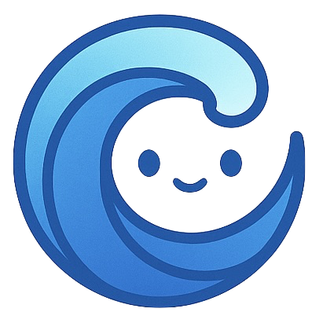

<p align="center">
  <a href="https://ozeanjs.com">
    
  </a>
</p>

<p align="center">A progressive <a href="https://ozeanjs.com">OzeanJs</a> framework for crafting efficient and scalable server-side applications.</p>

# OzeanJs 🌊

Welcome to [**OzeanJs**](https://ozeanjs.com)!

Tired of complex setups and repetitive boilerplate? OceanJs is your answer.

OceanJs is a modern, simple, and high-performance web framework built on the Bun runtime. It aims to provide a fast and enjoyable development experience, helping you build scalable and maintainable server-side applications with ease.

We've adapted the robust and well-regarded architecture of Angular for the back-end world, allowing you to organize your code systematically while leveraging the full performance of the Bun runtime.

### Why Choose OceanJs?

We didn't just build another framework; we built a tool to help you focus on creating excellent business logic without worrying about complex infrastructure.

### 🚀 Built for Speed

OceanJs is built on Bun, which means you benefit from the fastest runtime speed, dependency installation, and test execution available today, accelerating your entire development cycle.

### ✨ Organized & Scalable Architecture

With a system of Modules, Controllers, and Services inspired by Angular, your code is naturally organized, making it easy to understand, test, and scale your project into the future without chaos.

### 💉 Powerful Dependency Injection

Say goodbye to complex `require` or `import` statements. Our built-in DI system automatically creates and injects the services you need. Simply declare them in the `constructor`, resulting in cleaner, loosely coupled code.

### 👩‍💻 Excellent Developer Experience

We believe coding should be fun. With an intuitive Decorator-based API that's easy to read, a CLI that helps scaffold projects and files, and minimal initial setup, you can start your project and see results in minutes.

Spend less time on configuration and more time building amazing things.
Dive into OceanJs today!

# Quick Start

the fastest way to create and run your first OzeanJs project using the **Ozean CLI**.

### Prerequisites

Ensure you have **Bun** installed on your machine.

---

### Step 1: Create a New Project with the CLI

You don't need to install our CLI beforehand. You can use the `bunx` command to download and run it immediately.

Open your terminal and run the command:

```bash
bunx ozean-cli new my-awesome-app
```

**What does this command do?**

- **`bunx`**: Downloads and runs `ozean-cli` temporarily without a global installation.
- **`new my-awesome-app`**: Instructs the CLI to create a new project in a folder named `my-awesome-app` and automatically install all necessary dependencies.

Once the command is finished, navigate into your project folder:

```bash
cd my-awesome-app
```

---

### Step 2: Run the Development Server

Run your application in development mode with the command:

```bash
bun run dev
```

(This script is already defined in the `package.json` of the generated project.)

You should see a message in your terminal indicating that your application is running on `http://localhost:3000`.

---

### Step 3: Test the Application

Open another terminal and use `curl` to test if the server is working correctly:

```bash
curl http://localhost:3000/cats
```

**Expected Result:**

```
Hello cat.
```

That's it! In just 3 simple steps, your first OceanJs project is ready to go. Try opening the project in your favorite editor and start modifying the code in the `src` folder!

Happy coding with OzeanJs!
